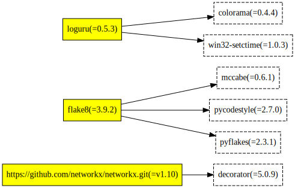
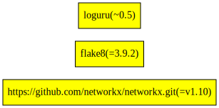

# Poetry

[Poetry](https://python-poetry.org/) is a tool for dependency management and packaging in Python.

## Project Discovery

Find all files named `pyproject.toml` and `poetry.lock`. Pyproject must use poetry for the build system.

## Analysis

We parse `pyproject.toml` -- to find direct dependencies and thier [version constraints](https://python-poetry.org/docs/dependency-specification/):

- `[tool.poetry.dependencies]` - production dependencies
- `[tool.poetry.dev-dependencies]` - development dependencies

To infer resolved version of direct and sub dependencies, we parse `poetry.lock` file. In this file we find,

- `[package.dependencies]` - package's dependencies 
- `package.category` - package's environment (dev, test, etc.)
- `package.name` - name of the package
- `package.version` - resolved version of the package

For projects, where `poetry.lock` file is not discovered, we fallback to reporting only direct dependencies parsed from `pyproject.toml`. 

### Limitations

* For poetry project, build system's `build-backend` must be set to `poetry.core.masonry.api` in `pyproject.toml` 
* All extras specified in `[tool.poetry.extras]` are currently not reported.
* Package names are case insensitive.

# Example 

`pyproject.toml` file (created by `poetry init` and adding relevant dependencies)

```toml
[tool.poetry]
authors = ["Megh <megh@fossa.com>"]
description = "Example poetry usage"
name = "example-poetry-usage"
version = "0.1.0"

[tool.poetry.dependencies]
loguru = "^0.5"
python = "^3.9"

# git source
flask = {git = "https://github.com/pallets/flask.git", rev = "38eb5d3b"}
networkx = {git = "https://github.com/networkx/networkx.git", branch = "v1.10"}
pandas = {git = "https://github.com/pandas-dev/pandas", tag = "v1.2.3"}
requests = {git = "https://github.com/kennethreitz/requests.git"}

# url source 
fastapi = {url = "https://files.pythonhosted.org/packages/63/30/c5c72431045f502d523bdf749ce9afa90ee1591426fcdd3db05f216ca8b7/fastapi-0.66.0.tar.gz"}

# file source
toml = {path = "toml-0.10.2.tar.gz"}

[tool.poetry.dev-dependencies]
black = {version = "19.10b0", allow-prereleases = true, python = "^3.6", markers = "platform_python_implementation == 'CPython'"}
flake8 = "3.9.2"

[build-system]
build-backend = "poetry.core.masonry.api"
requires = ["poetry-core>=1.0.0"]
```

and accompanying poetry.lock file (created by poetry at time of dependency resolution)

```toml
[[package]]
name = "appdirs"
version = "1.4.4"
description = "A small Python module for determining appropriate platform-specific dirs, e.g. a \"user data dir\"."
category = "dev"
optional = false
python-versions = "*"

[[package]]
name = "attrs"
version = "21.2.0"
description = "Classes Without Boilerplate"
category = "dev"
optional = false
python-versions = ">=2.7, !=3.0.*, !=3.1.*, !=3.2.*, !=3.3.*, !=3.4.*"

[package.extras]
dev = ["coverage[toml] (>=5.0.2)", "hypothesis", "pympler", "pytest (>=4.3.0)", "six", "mypy", "pytest-mypy-plugins", "zope.interface", "furo", "sphinx", "sphinx-notfound-page", "pre-commit"]
docs = ["furo", "sphinx", "zope.interface", "sphinx-notfound-page"]
tests = ["coverage[toml] (>=5.0.2)", "hypothesis", "pympler", "pytest (>=4.3.0)", "six", "mypy", "pytest-mypy-plugins", "zope.interface"]
tests_no_zope = ["coverage[toml] (>=5.0.2)", "hypothesis", "pympler", "pytest (>=4.3.0)", "six", "mypy", "pytest-mypy-plugins"]

[[package]]
name = "black"
version = "19.10b0"
description = "The uncompromising code formatter."
category = "dev"
optional = false
python-versions = ">=3.6"

[package.dependencies]
appdirs = "*"
attrs = ">=18.1.0"
click = ">=6.5"
pathspec = ">=0.6,<1"
regex = "*"
toml = ">=0.9.4"
typed-ast = ">=1.4.0"

[package.extras]
d = ["aiohttp (>=3.3.2)", "aiohttp-cors"]

[[package]]
name = "certifi"
version = "2021.5.30"
description = "Python package for providing Mozilla's CA Bundle."
category = "main"
optional = false
python-versions = "*"

[[package]]
name = "chardet"
version = "4.0.0"
description = "Universal encoding detector for Python 2 and 3"
category = "main"
optional = false
python-versions = ">=2.7, !=3.0.*, !=3.1.*, !=3.2.*, !=3.3.*, !=3.4.*"

[[package]]
name = "click"
version = "8.0.1"
description = "Composable command line interface toolkit"
category = "main"
optional = false
python-versions = ">=3.6"

[package.dependencies]
colorama = {version = "*", markers = "platform_system == \"Windows\""}

[[package]]
name = "colorama"
version = "0.4.4"
description = "Cross-platform colored terminal text."
category = "main"
optional = false
python-versions = ">=2.7, !=3.0.*, !=3.1.*, !=3.2.*, !=3.3.*, !=3.4.*"

[[package]]
name = "decorator"
version = "5.0.9"
description = "Decorators for Humans"
category = "main"
optional = false
python-versions = ">=3.5"

[[package]]
name = "fastapi"
version = "0.66.0"
description = "FastAPI framework, high performance, easy to learn, fast to code, ready for production"
category = "main"
optional = false
python-versions = ">=3.6"

[package.dependencies]
pydantic = ">=1.6.2,<1.7 || >1.7,<1.7.1 || >1.7.1,<1.7.2 || >1.7.2,<1.7.3 || >1.7.3,<1.8 || >1.8,<1.8.1 || >1.8.1,<2.0.0"
starlette = "0.14.2"

[package.extras]
all = ["requests (>=2.24.0,<3.0.0)", "aiofiles (>=0.5.0,<0.6.0)", "jinja2 (>=2.11.2,<3.0.0)", "python-multipart (>=0.0.5,<0.0.6)", "itsdangerous (>=1.1.0,<2.0.0)", "pyyaml (>=5.3.1,<6.0.0)", "graphene (>=2.1.8,<3.0.0)", "ujson (>=4.0.1,<5.0.0)", "orjson (>=3.2.1,<4.0.0)", "email_validator (>=1.1.1,<2.0.0)", "uvicorn[standard] (>=0.12.0,<0.14.0)", "async_exit_stack (>=1.0.1,<2.0.0)", "async_generator (>=1.10,<2.0.0)"]
dev = ["python-jose[cryptography] (>=3.1.0,<4.0.0)", "passlib[bcrypt] (>=1.7.2,<2.0.0)", "autoflake (>=1.3.1,<2.0.0)", "flake8 (>=3.8.3,<4.0.0)", "uvicorn[standard] (>=0.12.0,<0.14.0)", "graphene (>=2.1.8,<3.0.0)"]
doc = ["mkdocs (>=1.1.2,<2.0.0)", "mkdocs-material (>=7.1.9,<8.0.0)", "markdown-include (>=0.6.0,<0.7.0)", "mkdocs-markdownextradata-plugin (>=0.1.7,<0.2.0)", "typer-cli (>=0.0.12,<0.0.13)", "pyyaml (>=5.3.1,<6.0.0)"]
test = ["pytest (==5.4.3)", "pytest-cov (==2.10.0)", "pytest-asyncio (>=0.14.0,<0.15.0)", "mypy (==0.812)", "flake8 (>=3.8.3,<4.0.0)", "black (==20.8b1)", "isort (>=5.0.6,<6.0.0)", "requests (>=2.24.0,<3.0.0)", "httpx (>=0.14.0,<0.15.0)", "email_validator (>=1.1.1,<2.0.0)", "sqlalchemy (>=1.3.18,<1.4.0)", "peewee (>=3.13.3,<4.0.0)", "databases[sqlite] (>=0.3.2,<0.4.0)", "orjson (>=3.2.1,<4.0.0)", "ujson (>=4.0.1,<5.0.0)", "async_exit_stack (>=1.0.1,<2.0.0)", "async_generator (>=1.10,<2.0.0)", "python-multipart (>=0.0.5,<0.0.6)", "aiofiles (>=0.5.0,<0.6.0)", "flask (>=1.1.2,<2.0.0)"]

[package.source]
type = "url"
url = "https://files.pythonhosted.org/packages/63/30/c5c72431045f502d523bdf749ce9afa90ee1591426fcdd3db05f216ca8b7/fastapi-0.66.0.tar.gz"
[[package]]
name = "flake8"
version = "3.9.2"
description = "the modular source code checker: pep8 pyflakes and co"
category = "dev"
optional = false
python-versions = "!=3.0.*,!=3.1.*,!=3.2.*,!=3.3.*,!=3.4.*,>=2.7"

[package.dependencies]
mccabe = ">=0.6.0,<0.7.0"
pycodestyle = ">=2.7.0,<2.8.0"
pyflakes = ">=2.3.0,<2.4.0"

[[package]]
name = "Flask"
version = "1.1.2.dev0"
description = "A simple framework for building complex web applications."
category = "main"
optional = false
python-versions = ">=2.7, !=3.0.*, !=3.1.*, !=3.2.*, !=3.3.*, !=3.4.*"
develop = false

[package.dependencies]
click = ">=5.1"
itsdangerous = ">=0.24"
Jinja2 = ">=2.10.1"
Werkzeug = ">=0.15"

[package.extras]
dev = ["pytest", "coverage", "tox", "sphinx", "pallets-sphinx-themes", "sphinxcontrib-log-cabinet", "sphinx-issues"]
docs = ["sphinx", "pallets-sphinx-themes", "sphinxcontrib-log-cabinet", "sphinx-issues"]
dotenv = ["python-dotenv"]

[package.source]
type = "git"
url = "https://github.com/pallets/flask.git"
reference = "38eb5d3b"
resolved_reference = "38eb5d3b49d628785a470e2e773fc5ac82e3c8e4"

[[package]]
name = "idna"
version = "2.10"
description = "Internationalized Domain Names in Applications (IDNA)"
category = "main"
optional = false
python-versions = ">=2.7, !=3.0.*, !=3.1.*, !=3.2.*, !=3.3.*"

[[package]]
name = "itsdangerous"
version = "2.0.1"
description = "Safely pass data to untrusted environments and back."
category = "main"
optional = false
python-versions = ">=3.6"

[[package]]
name = "jinja2"
version = "3.0.1"
description = "A very fast and expressive template engine."
category = "main"
optional = false
python-versions = ">=3.6"

[package.dependencies]
MarkupSafe = ">=2.0"

[package.extras]
i18n = ["Babel (>=2.7)"]

[[package]]
name = "loguru"
version = "0.5.3"
description = "Python logging made (stupidly) simple"
category = "main"
optional = false
python-versions = ">=3.5"

[package.dependencies]
colorama = {version = ">=0.3.4", markers = "sys_platform == \"win32\""}
win32-setctime = {version = ">=1.0.0", markers = "sys_platform == \"win32\""}

[package.extras]
dev = ["codecov (>=2.0.15)", "colorama (>=0.3.4)", "flake8 (>=3.7.7)", "tox (>=3.9.0)", "tox-travis (>=0.12)", "pytest (>=4.6.2)", "pytest-cov (>=2.7.1)", "Sphinx (>=2.2.1)", "sphinx-autobuild (>=0.7.1)", "sphinx-rtd-theme (>=0.4.3)", "black (>=19.10b0)", "isort (>=5.1.1)"]

[[package]]
name = "markupsafe"
version = "2.0.1"
description = "Safely add untrusted strings to HTML/XML markup."
category = "main"
optional = false
python-versions = ">=3.6"

[[package]]
name = "mccabe"
version = "0.6.1"
description = "McCabe checker, plugin for flake8"
category = "dev"
optional = false
python-versions = "*"

[[package]]
name = "networkx"
version = "1.10"
description = "Python package for creating and manipulating graphs and networks"
category = "main"
optional = false
python-versions = "*"
develop = false

[package.dependencies]
decorator = ">=3.4.0"

[package.source]
type = "git"
url = "https://github.com/networkx/networkx.git"
reference = "v1.10"
resolved_reference = "4d364bfcee7b24f3df137e8dcd36f7a547892e55"

[[package]]
name = "numpy"
version = "1.21.0"
description = "NumPy is the fundamental package for array computing with Python."
category = "main"
optional = false
python-versions = ">=3.7"

[[package]]
name = "pandas"
version = "1.2.3"
description = "Powerful data structures for data analysis, time series, and statistics"
category = "main"
optional = false
python-versions = ">=3.7.1"
develop = false

[package.dependencies]
numpy = ">=1.16.5"
python-dateutil = ">=2.7.3"
pytz = ">=2017.3"

[package.extras]
test = ["pytest (>=5.0.1)", "pytest-xdist", "hypothesis (>=3.58)"]

[package.source]
type = "git"
url = "https://github.com/pandas-dev/pandas"
reference = "v1.2.3"
resolved_reference = "f2c8480af2f25efdbd803218b9d87980f416563e"

[[package]]
name = "pathspec"
version = "0.8.1"
description = "Utility library for gitignore style pattern matching of file paths."
category = "dev"
optional = false
python-versions = ">=2.7, !=3.0.*, !=3.1.*, !=3.2.*, !=3.3.*, !=3.4.*"

[[package]]
name = "pycodestyle"
version = "2.7.0"
description = "Python style guide checker"
category = "dev"
optional = false
python-versions = ">=2.7, !=3.0.*, !=3.1.*, !=3.2.*, !=3.3.*"

[[package]]
name = "pydantic"
version = "1.8.2"
description = "Data validation and settings management using python 3.6 type hinting"
category = "main"
optional = false
python-versions = ">=3.6.1"

[package.dependencies]
typing-extensions = ">=3.7.4.3"

[package.extras]
dotenv = ["python-dotenv (>=0.10.4)"]
email = ["email-validator (>=1.0.3)"]

[[package]]
name = "pyflakes"
version = "2.3.1"
description = "passive checker of Python programs"
category = "dev"
optional = false
python-versions = ">=2.7, !=3.0.*, !=3.1.*, !=3.2.*, !=3.3.*"

[[package]]
name = "python-dateutil"
version = "2.8.1"
description = "Extensions to the standard Python datetime module"
category = "main"
optional = false
python-versions = "!=3.0.*,!=3.1.*,!=3.2.*,>=2.7"

[package.dependencies]
six = ">=1.5"

[[package]]
name = "pytz"
version = "2021.1"
description = "World timezone definitions, modern and historical"
category = "main"
optional = false
python-versions = "*"

[[package]]
name = "regex"
version = "2021.7.6"
description = "Alternative regular expression module, to replace re."
category = "dev"
optional = false
python-versions = "*"

[[package]]
name = "requests"
version = "2.25.1"
description = "Python HTTP for Humans."
category = "main"
optional = false
python-versions = ">=2.7, !=3.0.*, !=3.1.*, !=3.2.*, !=3.3.*, !=3.4.*"
develop = false

[package.dependencies]
certifi = ">=2017.4.17"
chardet = ">=3.0.2,<5"
idna = ">=2.5,<3"
urllib3 = ">=1.21.1,<1.27"

[package.extras]
security = ["pyOpenSSL (>=0.14)", "cryptography (>=1.3.4)"]
socks = ["PySocks (>=1.5.6,!=1.5.7)", "win-inet-pton"]

[package.source]
type = "git"
url = "https://github.com/kennethreitz/requests.git"
reference = "master"
resolved_reference = "083aa67a0d3309ebe37eafbe7bfd96c235a019cf"

[[package]]
name = "six"
version = "1.16.0"
description = "Python 2 and 3 compatibility utilities"
category = "main"
optional = false
python-versions = ">=2.7, !=3.0.*, !=3.1.*, !=3.2.*"

[[package]]
name = "starlette"
version = "0.14.2"
description = "The little ASGI library that shines."
category = "main"
optional = false
python-versions = ">=3.6"

[package.extras]
full = ["aiofiles", "graphene", "itsdangerous", "jinja2", "python-multipart", "pyyaml", "requests"]

[[package]]
name = "toml"
version = "0.10.2"
description = "Python Library for Tom's Obvious, Minimal Language"
category = "main"
optional = false
python-versions = ">=2.6, !=3.0.*, !=3.1.*, !=3.2.*"

[package.source]
type = "file"
url = "toml-0.10.2.tar.gz"

[[package]]
name = "typed-ast"
version = "1.4.3"
description = "a fork of Python 2 and 3 ast modules with type comment support"
category = "dev"
optional = false
python-versions = "*"

[[package]]
name = "typing-extensions"
version = "3.10.0.0"
description = "Backported and Experimental Type Hints for Python 3.5+"
category = "main"
optional = false
python-versions = "*"

[[package]]
name = "urllib3"
version = "1.26.6"
description = "HTTP library with thread-safe connection pooling, file post, and more."
category = "main"
optional = false
python-versions = ">=2.7, !=3.0.*, !=3.1.*, !=3.2.*, !=3.3.*, !=3.4.*, <4"

[package.extras]
brotli = ["brotlipy (>=0.6.0)"]
secure = ["pyOpenSSL (>=0.14)", "cryptography (>=1.3.4)", "idna (>=2.0.0)", "certifi", "ipaddress"]
socks = ["PySocks (>=1.5.6,!=1.5.7,<2.0)"]

[[package]]
name = "werkzeug"
version = "2.0.1"
description = "The comprehensive WSGI web application library."
category = "main"
optional = false
python-versions = ">=3.6"

[package.extras]
watchdog = ["watchdog"]

[[package]]
name = "win32-setctime"
version = "1.0.3"
description = "A small Python utility to set file creation time on Windows"
category = "main"
optional = false
python-versions = ">=3.5"

[package.extras]
dev = ["pytest (>=4.6.2)", "black (>=19.3b0)"]

[metadata]
lock-version = "1.1"
python-versions = "^3.9"
content-hash = "8ee67ac6ad0847e40b89fc5dbdeb72828bbab05ed3b7ba44901ded85f258f504"

# [metadata.files] not shown for brevity
```

We will produce the following dependency graph, from our analyses if both `poetry.lock` and `pyproject.toml` are discovered.


_Dependencies highlighted in yellow boxes are direct dependencies, rest are deep dependencies._

If only, `pyproject.toml` is discovered, following dependency graph will be produced. 


_Dependencies highlighted in yellow boxes are direct dependencies, rest are deep dependencies._

Note, without `poetry.lock` we are not able to identify sub dependencies and dependency's resolved versions.